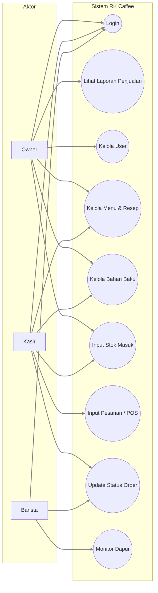
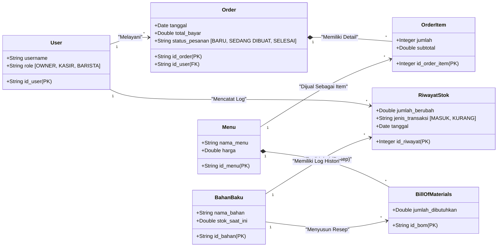
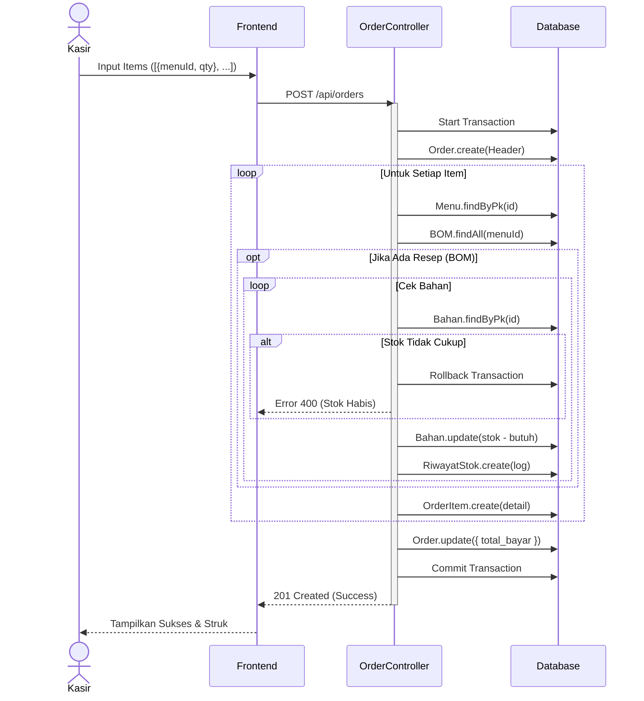
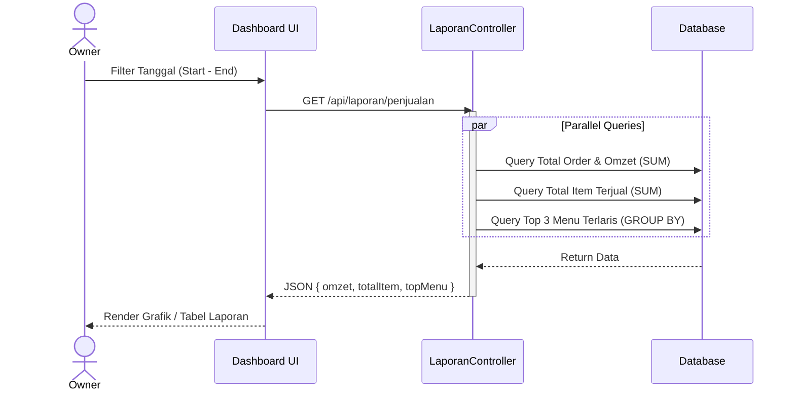

# Dokumentasi Sistem RK Caffee Backend

Dokumen ini berisi rancangan teknis (Architecture Design) untuk sistem backend RK Caffee, yang dibuat berdasarkan analisis struktur kode sumber (Source Code Analysis). Diagram berikut merepresentasikan logika bisnis, struktur database, dan alur kerja sistem saat ini.

---

## 1. Analisis Aktor & Hak Akses

Sistem ini membagi pengguna menjadi 3 peran (Role) dengan hak akses sebagai berikut:

| Aktor       | Deskripsi Peran            | Hak Akses Utama                                                                                       |
| :---------- | :------------------------- | :---------------------------------------------------------------------------------------------------- |
| **OWNER**   | Administrator & Pemilik    | Akses Penuh (Full Access) ke semua fitur, termasuk Manajemen User dan Melihat Laporan Keuangan.       |
| **KASIR**   | Operasional Depan & Gudang | Melayani Transaksi (POS), Mengelola Data Bahan Baku (Inventori), Mengatur Menu, dan Input Stok Masuk. |
| **BARISTA** | Operasional Dapur          | Memonitor pesanan masuk (Kitchen Display) dan memperbarui status pesanan (Dibuat -> Selesai).         |

---

## 2. Use Case Diagram

Diagram interaksi antara Aktor dengan Fitur Sistem.



---

## 3. Class Diagram (ERD & Struktur Data)

Representasi hubungan antar tabel database (Model Sequelize).



---

## 4. Activity Diagram

Diagram alur proses (Workflow) utama dalam sistem.

### A. Alur Transaksi Pemesanan (Selling Process)

Menjelaskan proses otomatisasi pemotongan stok saat pesanan dibuat.

```mermaid
flowchart TD
    subgraph KASIR
        Start([Mulai]) --> PilihMenu[Pilih Menu & Jumlah]
        PilihMenu --> Submit[Klik Buat Pesanan]
    end

    subgraph SISTEM
        Submit --> Transaksi[Mulai Transaksi Database]
        Transaksi --> CreateHead[Buat Order Header (Status: BARU)]

        CreateHead --> LoopItem{Loop Setiap Item}

        LoopItem --> GetBOM[Cek Resep (BOM) & Stok]

        GetBOM -- Stok Kurang --> Rollback[Batalkan Transaksi]
        Rollback --> Error[Tampilkan Error Stok Habis]

        GetBOM -- Stok Cukup --> Potong[Potong Stok & Catat Log]
        Potong --> CreateItem[Simpan Order Item]
        CreateItem --> NextItem{Ada Item Lain?}

        NextItem -- Ya --> LoopItem
        NextItem -- Tidak --> UpdateTotal[Update Total Bayar]

        UpdateTotal --> Commit[Simpan Permanen (Commit)]
        Commit --> Sukses[Return Sukses]
    end

    Error --> End([Gagal])
    Sukses --> End([Selesai])
```

### B. Alur Penyetokan Barang (Restock Process)

Menjelaskan proses penambahan stok manual.

```mermaid
flowchart TD
    Start([Mulai]) --> Login[Login User (Owner/Kasir)]
    Login --> Menu[Pilih Menu Riwayat Stok]
    Menu --> Input[Input: Bahan, Jumlah, Tipe 'MASUK']

    Input --> Validasi{Data Valid?}
    Validasi -- Tidak --> Error[Tampilkan Error] --> Input

    Validasi -- Ya --> Update[Update Stok Bahan (+)]
    Update --> Log[Catat Log Riwayat Stok]
    Log --> Show[Tampilkan Sukses] --> End([Selesai])
```

---

## 5. Sequence Diagram

Diagram detail interaksi objek/modul teknis per skenario.

### A. Sequence: Create Order (Multi-Item)



### B. Sequence: Lihat Laporan (Owner)


